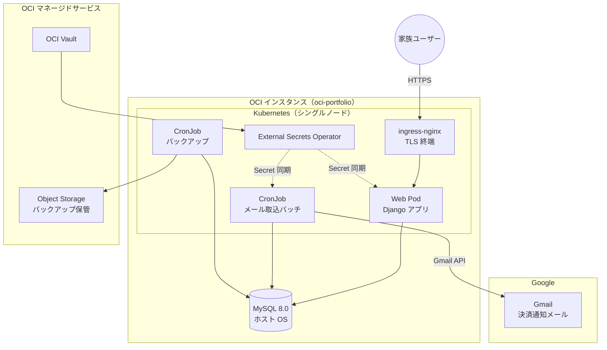

# 要件定義書 - kakeibo（OCI 移行版）

## 1. プロジェクト概要

### 1.1. 目的

現在 Google Apps Script（GAS）と Google スプレッドシートで運用している個人家計簿システムを、
OCI（Oracle Cloud Infrastructure）上の Kubernetes クラスタで稼働する Web アプリケーションとして再構築する。

### 1.2. 背景・移行理由

現行システムには以下の課題がある。

- **スプレッドシート依存**: データ量の増加に伴い集計数式が重く、リレーショナルな集計・検索ができない
- **GAS の制約**: 実行時間上限、デバッグ性の低さ、テストの書きづらさ
- **拡張の限界**: 収入・資産残高といった新たな管理対象を追加しづらい
- **AI 判定の不安定さ**: Gemini API によるカテゴリ自動判定が期待どおりに機能しない

### 1.3. 移行方針

- データストアを Google スプレッドシートから MySQL へ全面移行し、**DB を唯一の正**とする
- スプレッドシートおよび GAS は移行完了後に**完全廃止**する
- Google への依存は **Gmail API によるメール取得のみ**に縮小する
- Gemini API によるカテゴリ自動判定は**廃止**する

## 2. 対象範囲

### 2.1. スコープ内

| 分類 | 内容 |
| ---- | ---- |
| 支出管理 | 決済通知メールの自動取込、手動入力、固定費 |
| 収入管理 | 給与・賞与・その他収入の記録（**新規**） |
| 資産管理 | 口座・電子マネー等の残高記録と推移（**新規**） |
| 集計・可視化 | 月次収支、カテゴリ別集計、予算対比、資産推移 |
| マスタ管理 | カテゴリ、店舗ルール、固定費、口座、決済手段 |
| 認証 | Google OAuth による家族メンバーのログイン |
| 運用 | バックアップ、エラー通知、ログ |

### 2.2. スコープ外

- 金融機関 API・スクレイピングによる残高自動連携（残高は手動記録とする）
- レシート画像の OCR 登録
- AI / 機械学習によるカテゴリ自動分類
- 確定申告・税務計算の支援
- スマートフォンネイティブアプリ（レスポンシブ Web で対応する）
- マルチテナント対応（本システムは単一世帯専用）

### 2.3. 現行機能との差分

| 現行機能 | 移行後の扱い |
| -------- | ------------ |
| メール自動取込（楽天ペイ / 楽天ペイオンライン / 楽天カード） | 継続（Gmail API 経由に変更） |
| 店舗ルールによるカテゴリ判定 | 継続 |
| Gemini API によるカテゴリ判定 | **廃止** |
| 手動入力 Web 画面 | 継続（Django ビューで再実装） |
| 固定費マスタからの月次集計参照 | 継続 |
| 月次集計シート（予算・実績・差額・過去5ヶ月） | 継続（画面上の集計として再実装） |
| 収入管理 | **新規追加** |
| 資産残高管理 | **新規追加** |
| 共通パスワード認証 | **廃止**（Google OAuth へ変更） |

## 3. 用語定義

| 用語 | 定義 |
| ---- | ---- |
| 取引 | 支出または収入の 1 レコード |
| 変動費 | メール取込・手動入力で登録される都度発生の支出 |
| 固定費 | 住宅ローン等、毎月定額で発生する支出。マスタ定義から月次集計に算入する |
| 店舗ルール | 店舗名キーワードとカテゴリの対応定義。取込時のカテゴリ自動判定に使用する |
| 未分類 | 店舗ルールに一致せずカテゴリが確定していない状態 |
| 口座 | 資産残高の記録単位（銀行口座、証券口座、電子マネー、現金など） |

## 4. システム構成

### 4.1. 前提インフラ

本システムは `infra-oci-terraform` および `infra-oci-ansible` で構築済みの基盤上で稼働する。
アプリケーションのコンテナイメージおよび Kubernetes マニフェストは本リポジトリで管理する。

| 項目 | 内容 |
| ---- | ---- |
| クラウド | OCI（Always Free 枠を基本とする） |
| ホスト | Ubuntu 24.04 LTS（ホスト名 `oci-portfolio`） |
| コンテナ基盤 | kubeadm によるシングルノード Kubernetes（Control Plane 兼 Worker） |
| 外部公開 | `ingress-nginx`（HostNetwork で 80/443 を占有） |
| TLS | `cert-manager` + Let's Encrypt による証明書自動管理 |
| データベース | MySQL 8.0（ホスト OS に直接導入、`bind-address: 127.0.0.1`） |
| 機密情報 | OCI Vault + External Secrets Operator により Kubernetes Secret へ同期 |
| 永続ボリューム | `local-path-provisioner` |

### 4.2. 技術スタック

| 分類 | 採用技術 | 選定理由 |
| ---- | -------- | -------- |
| 言語 | Python 3.12 以降 | 本業（インフラ自動化）で使用する言語とのスキル統合を図る |
| フレームワーク | Django | 管理画面・認証・ORM・マイグレーションを標準搭載し、開発工数を抑えられる |
| マスタ保守画面 | Django Admin（標準機能） | カテゴリ・店舗ルール・固定費等の保守を追加実装なしで賄える |
| 認証 | django-allauth（Google OAuth） | Google アカウント認証を標準的な手順で実装できる |
| メール取得 | `google-api-python-client` | Gmail API 用の Google 公式クライアント |
| DB ドライバ | `mysqlclient` | Django が公式に推奨する MySQL ドライバ |
| フロントエンド | Django テンプレート + 軽量 JS | SPA を構築せず、サーバサイドレンダリングで完結させる |
| グラフ描画 | クライアントサイドのグラフライブラリ | 月次推移・構成比・資産推移の可視化に使用する |

### 4.3. 構成図

## 5. 機能要件

### 5.1. メール自動取込機能

#### 5.1.1. 取込対象

以下の決済サービスの通知メールを対象とする。

| サービス | 送信元 | 件名 |
| -------- | ------ | ---- |
| 楽天ペイ（アプリ決済） | `no-reply@pay.rakuten.co.jp` | 楽天ペイアプリご利用内容 |
| 楽天ペイ（オンライン決済） | `payment@checkout.rakuten.co.jp` | 楽天ペイ（オンライン決済） |
| 楽天ペイ（注文受付） | `order@checkout.rakuten.co.jp` | 楽天ペイ 注文受付 |
| 楽天カード | `info@mail.rakuten-card.co.jp` | カード利用のお知らせ |

#### 5.1.2. 要件

1. Kubernetes CronJob により日次で自動実行する。
2. Gmail API を使用し、Gmail 上のラベル（例: `家計簿/未処理`）が付与されたメールを取得対象とする。ラベル付与は Gmail 側のフィルタ機能で行う。
3. 送信元および件名からサービスを識別し、対応するパーサーで解析する。
4. 抽出項目は、利用日・金額・店舗名・決済手段とする。
5. 楽天カードのように 1 通のメールに複数明細を含む場合は、明細ごとに 1 レコードとして登録する。
6. 取込に成功したメールはラベルを処理済み（例: `家計簿/処理済`）へ付け替える。
7. 解析に失敗したメールは未処理ラベルのまま残し、再実行で再処理できるようにする。
8. パーサーを識別できない、または解析に失敗した場合は、対象メールの送信元・件名・本文抜粋を含むエラー通知を送信する。
9. 対応サービスの追加が、設定定義とパーサー実装の追加のみで完結する構造とする。

#### 5.1.3. 重複排除

1. 取込済みの Gmail メッセージ ID を記録し、同一メッセージを再取込しない。
2. 取引レコードに対し、日付・金額・店舗名・決済手段の組み合わせから生成した重複排除キーを保持し、同一キーの登録を抑止する。

### 5.2. カテゴリ判定機能

1. 店舗ルールマスタを参照し、店舗名にキーワードが部分一致するカテゴリを適用する。
2. 比較の前に、店舗名およびキーワードの大文字小文字・全角半角を正規化する。
3. 複数のルールに一致する場合は、定義順で最初に一致したものを採用する。
4. いずれのルールにも一致しない場合は、カテゴリを **未分類** として登録する。
5. Web 画面に未分類の取引一覧を表示し、ユーザーがカテゴリを割り当てられるようにする。
6. ユーザーがカテゴリを割り当てた際、その店舗名をキーワードとして店舗ルールへ自動登録する（次回以降は自動判定される）。
7. 自動登録するキーワードは、店舗名から店舗を識別できる部分を抽出した値とし、ユーザーが後から Django Admin で編集できるものとする。

> **補足**: 現行システムでは未ヒット時に Gemini API で推論していたが、判定精度が安定しないため廃止する。
> 上記 4〜6 により、初回のみ手動割当が必要となり、2 回目以降は自動判定される。

### 5.3. 手動入力機能

1. メールで自動取得できない支出（現金払い、口座引落等）を Web 画面から登録できる。
2. 入力項目は、日付（必須）、金額（必須）、店舗名・支払先（必須）、カテゴリ（選択）、決済手段（選択）、メモ（任意）とする。
3. 直近の登録一覧を表示し、内容の修正および削除ができる。
4. 収入についても同様に手動で登録できる（5.5 参照）。
5. スマートフォンのブラウザから支障なく操作できるレスポンシブ表示とする。

### 5.4. 固定費管理機能

1. 固定費マスタに、支払先・金額・カテゴリ・決済手段・適用開始月・適用終了月・メモを定義する。
2. 固定費は取引レコードとして複製せず、月次集計時にマスタを参照して算入する。
3. 適用開始月以前の月、および適用終了月より後の月には算入しない。
4. 金額改定に対応できるよう、同一支払先で期間の異なる複数定義を保持できるものとする。

### 5.5. 収入管理機能（新規）

1. 収入を取引の一種として記録する。
2. 入力項目は、日付、金額、収入元（勤務先名等）、収入カテゴリ、入金先口座、メモとする。
3. 収入カテゴリは、給与・賞与・臨時収入・その他などをマスタで定義する。
4. 毎月定額の収入（給与等）を固定収入としてマスタ定義し、固定費と同様に月次集計へ算入できるものとする。
5. 月次集計において、収入合計・支出合計・収支差額を算出する。

### 5.6. 資産残高管理機能（新規）

1. 資産の記録単位となる口座をマスタで管理する。属性は、口座名・種別（銀行 / 証券 / 電子マネー / 現金 / その他）・通貨・表示順・有効フラグとする。
2. 各口座の残高を、基準日を指定して手動で記録する（残高スナップショット方式）。
3. 同一口座・同一基準日の記録は 1 件に限定し、再登録時は上書きする。
4. 最新の記録日時点における総資産額および口座種別ごとの内訳を表示する。
5. 月次の総資産推移をグラフで表示する。
6. 金融機関との自動連携は行わない。

### 5.7. 集計・可視化機能

1. 月を指定して、以下を表示する。
   1. カテゴリ別の支出実績（変動費 + 固定費）
   2. カテゴリ別の月次予算および予算との差額
   3. 収入合計・支出合計・収支差額
2. カテゴリごとに月次予算を設定できる。予算超過は視覚的に判別できる表示とする。
3. カテゴリに「集計対象」フラグを持たせ、振替・返金など集計に含めない取引を除外できるものとする。
4. 以下のグラフを表示する。
   1. 月次支出推移（直近 12 ヶ月）
   2. 当月のカテゴリ別支出構成比
   3. 月次収支推移（収入・支出・差額）
   4. 総資産推移
5. 取引一覧を、期間・カテゴリ・決済手段・金額範囲・店舗名で絞り込み検索できる。
6. 取引一覧を CSV 形式で出力できる。

### 5.8. マスタ管理機能

以下のマスタを Django Admin で保守する。Django Admin は開発者（staff 権限）専用とし、一般利用者には公開しない。

| マスタ | 主な属性 |
| ------ | -------- |
| カテゴリ | 名称、区分（支出 / 収入）、月次予算、集計対象フラグ、表示順 |
| 店舗ルール | 店舗名キーワード、カテゴリ、優先順位 |
| 固定費 | 支払先、金額、カテゴリ、決済手段、適用開始月、適用終了月、メモ |
| 固定収入 | 収入元、金額、収入カテゴリ、入金先口座、適用開始月、適用終了月 |
| 口座 | 口座名、種別、通貨、表示順、有効フラグ |
| 決済手段 | 名称、紐づく口座、表示順 |
| 許可ユーザー | メールアドレス、表示名、権限区分 |

### 5.9. 認証・認可機能

1. Google OAuth（OpenID Connect）によるログインを提供する。
2. 事前に登録した許可メールアドレスのみログインを許可し、それ以外は認証成功後もアクセスを拒否する。
3. 未認証状態では、ログイン画面を除く全ページへのアクセスを拒否する。
4. 権限区分を以下の 2 段階とする。
   1. **管理者**: 全機能および Django Admin を利用できる
   2. **一般**: 取引の登録・参照・集計閲覧のみ利用でき、Django Admin にはアクセスできない
5. 取引レコードには登録者を記録し、誰が登録したかを追跡できるようにする。
6. セッションには有効期限を設け、一定時間の無操作で再認証を求める。

### 5.10. データ移行機能

1. 現行スプレッドシートの生データ・店舗ルール・固定費マスタ・カテゴリ（月次集計シート A〜C 列）を MySQL へ移行する。
2. 移行は CSV エクスポートを入力とする一括投入方式とし、Django の管理コマンドとして実装する。
3. 移行後、件数および月次合計金額が移行前と一致することを検証する。
4. 移行完了後、スプレッドシートは参照専用のアーカイブとして凍結し、GAS のトリガーおよびデプロイを停止・削除する。

## 6. データ要件

### 6.1. 管理対象エンティティ

| エンティティ | 概要 | 主な発生源 |
| ------------ | ---- | ---------- |
| 取引 | 支出・収入の明細 | メール取込 / 手動入力 |
| カテゴリ | 支出・収入の分類 | マスタ |
| 店舗ルール | 店舗名からカテゴリを判定する規則 | マスタ / 自動学習 |
| 固定費 | 毎月定額で発生する支出の定義 | マスタ |
| 固定収入 | 毎月定額で発生する収入の定義 | マスタ |
| 口座 | 資産の記録単位 | マスタ |
| 残高スナップショット | 口座ごと・基準日ごとの残高 | 手動入力 |
| 決済手段 | 支払方法の分類 | マスタ |
| ユーザー | 許可メールアドレスと権限 | マスタ |
| 取込ログ | メール取込の実行結果と処理済みメッセージ ID | バッチ |

### 6.2. データ保持方針

1. 取引データは削除せず、論理削除により履歴を保持する。
2. 金額は整数（円）で保持し、浮動小数点数を用いない。
3. 文字コードは `utf8mb4`、照合順序は `utf8mb4_0900_ai_ci` とする。
4. 日時はアプリケーション側で `Asia/Tokyo` を基準に扱う。

## 7. 非機能要件

### 7.1. 可用性

1. シングルノード構成のため、インスタンス障害時は全機能が停止することを許容する。
2. 目標復旧時間（RTO）は 1 営業日以内とし、IaC による環境再構築とバックアップからのリストアで復旧する。
3. 目標復旧時点（RPO）は 24 時間以内とする。

### 7.2. 性能

1. 主要画面の応答時間は、通常のデータ量において 2 秒以内を目標とする。
2. メール取込バッチは、日次の対象件数（数十件程度）を 5 分以内に処理する。
3. 10 年分（数万件規模）の取引データを保持しても、集計画面の応答性能を維持できる設計とする。

### 7.3. セキュリティ

1. 認証情報・API キー（Google OAuth クライアントシークレット、リフレッシュトークン、
   DB パスワード等）は OCI Vault で管理し、External Secrets Operator 経由で
   Kubernetes Secret として供給する。ソースコードおよびコンテナイメージに埋め込まない。
2. 外部公開は HTTPS のみとし、HTTP はリダイレクトする。TLS 証明書は cert-manager により自動更新する。
3. Django の標準セキュリティ機構（CSRF 対策、XSS 対策、SQL インジェクション対策、セキュアクッキー）を有効にする。
4. `DEBUG` は本番環境で必ず無効とし、`ALLOWED_HOSTS` を明示的に限定する。
5. Django Admin は管理者権限のユーザーのみアクセスできるものとする。
6. データベースへの接続はクラスタ内部からのみとし、外部ネットワークへ公開しない。

### 7.4. バックアップ・リストア

前提基盤（`infra-oci-ansible`）の要件定義では「インスタンス内のデータの永続化管理は行わず、紛失を許容する」方針が示されているが、
**本システムの家計簿データは決済通知メールからの再取得が不可能な資産であるため、本システム固有の要件としてバックアップを必須とする。**

1. Kubernetes CronJob により、日次で MySQL の論理バックアップ（`mysqldump`）を取得する。
2. 取得したバックアップは圧縮のうえ OCI Object Storage へ転送する。
3. 世代管理を行い、日次 30 世代および月次 12 世代を保持する。
4. 四半期に 1 回を目安に、バックアップからのリストア手順を実際に検証する。
5. バックアップの成否を通知し、失敗時に検知できるようにする。

想定されるリソース消費は OCI Always Free 枠に十分収まる。

| 項目 | Always Free 枠 | 想定使用量 |
| ---- | -------------- | ---------- |
| Object Storage 容量 | 20 GB（Standard / IA / Archive の合計） | 数十 MB |
| Object Storage API リクエスト | 50,000 リクエスト / 月 | 100 リクエスト未満 / 月 |
| 送信データ転送 | 10 TB / 月 | 実質なし（アップロードは対象外） |

### 7.5. 運用・保守

1. アプリケーションログは標準出力へ出力し、Kubernetes のログ基盤で参照できるものとする。
2. 以下の事象発生時に管理者へメール通知する。
   1. メール取込の解析失敗
   2. バッチの異常終了
   3. バックアップの失敗
3. デプロイはコンテナイメージのビルドと Kubernetes マニフェストの適用により行い、手動でのファイル配置を伴わない。
4. データベーススキーマの変更は Django のマイグレーションで管理し、手動 DDL を行わない。

### 7.6. コスト

1. OCI の Always Free 枠内での運用を基本とし、恒常的な課金が発生しないこと。
2. Gmail API は無料の利用枠内で運用する。
3. 有料の外部 SaaS・API に依存しないこと。

### 7.7. 移植性・保守性

1. ローカル開発環境を Docker で構築し、本番と同一のミドルウェア構成で開発できるものとする。
2. 主要なビジネスロジック（メールパーサー、カテゴリ判定、集計）に自動テストを整備する。
3. メールパーサーは、送信元・件名・抽出ロジックを定義として分離し、新規サービスの追加が局所的な変更で済む構造とする。

## 8. 制約・前提条件

1. 本システムは単一世帯・少人数（数名）での利用を前提とし、同時アクセス数は極めて少ない。
2. データベースはホスト OS 上の既存 MySQL を共用し、本システム専用のスキーマとユーザーを作成する。
3. 外部公開用のドメイン名を用意し、DNS を OCI インスタンスのパブリック IP へ向けること。
4. Google Cloud プロジェクトを作成し、Gmail API の有効化と OAuth クライアントの発行を行うこと。

## 9. 未決事項・設計時の論点

以下は本要件定義時点で未確定であり、設計フェーズで決定する。

1. **Pod から MySQL への接続方式**
   ホスト OS の MySQL は `bind-address: 127.0.0.1` で待ち受けているため、Pod から直接接続できない。
   Headless Service と Endpoints によるホスト IP 参照、`hostNetwork` の使用、`bind-address` の変更のいずれかを設計時に選定する。
   いずれを選ぶ場合も、OCI セキュリティ・リストおよび MySQL のユーザー権限で接続元を限定すること。

2. **Gmail API のリフレッシュトークン失効対策**
   Google の OAuth 同意画面が「テスト」ステータスの場合、リフレッシュトークンが短期間（数日）で失効し、
   バッチが継続的に停止する。同意画面を「本番環境」へ公開するか、サービスアカウント + ドメイン全体の委任を用いるかを設計時に決定する。
   本要件では**同意画面を本番公開する方式**を第一候補とする。

3. **前提基盤の構成名称の差異**
   本システムが載る Kubernetes は OCI の managed Kubernetes（OKE）ではなく、
   kubeadm で構築したセルフマネージドのシングルノードクラスタである。可用性・スケーリングに関する要件は当該構成を前提としている。

4. **決済手段と口座の紐づけ方針**
   クレジットカード利用が引き落とし口座の残高へ反映されるまでのタイムラグをどう扱うか（発生主義 / 現金主義）を設計時に整理する。
   本要件では取引の計上は**発生主義**（利用日基準）とし、資産残高は手動記録による実残高とする。

5. **カテゴリ自動学習時のキーワード抽出規則**
   店舗名からどの部分をキーワードとして切り出すかの規則は、実データを確認しながら設計時に定める。
