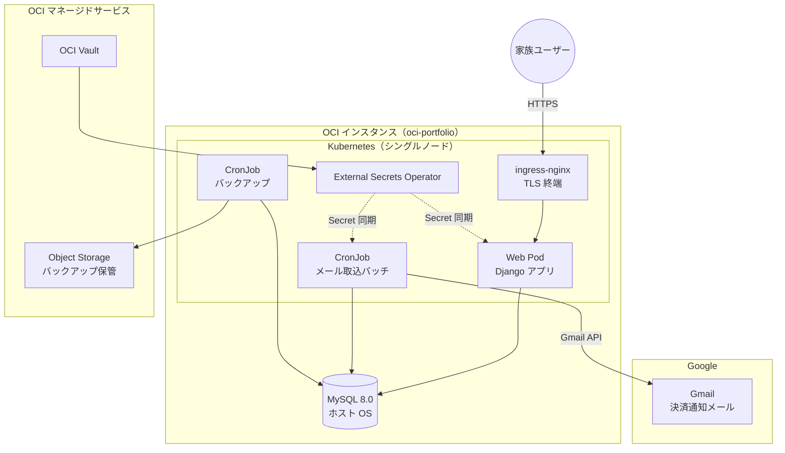

# 基本設計書 - kakeibo（OCI 移行版）

[要件定義書](../01.要件定義/要件定義書.md) に定めた要件を実現するための構造を定義する。

> **本書の状態**: 初版。要件定義フェーズで確定した範囲（システム構成、技術スタック、
> メール識別ルール、データ保持方針）を記載している。
> データモデル・画面設計・バッチ設計・非機能の実現方式は未記載であり、順次追記する。
> 未決の論点は第 7 章を参照。

## 1. システム構成

### 1.1. 前提インフラ

本システムは `infra-oci-terraform` および `infra-oci-ansible` で構築済みの基盤上で稼働する。
アプリケーションのコンテナイメージおよび Kubernetes マニフェストは本リポジトリで管理する。

| 項目 | 内容 |
| ---- | ---- |
| クラウド | OCI（Always Free 枠を基本とする） |
| ホスト | Ubuntu 24.04 LTS（ホスト名 `oci-portfolio`） |
| コンテナ基盤 | kubeadm によるシングルノード Kubernetes（Control Plane 兼 Worker） |
| 外部公開 | `ingress-nginx`（HostNetwork で 80/443 を占有） |
| TLS | `cert-manager` + Let's Encrypt による証明書自動管理 |
| データベース | MySQL 8.0（ホスト OS に直接導入、`bind-address: 127.0.0.1`） |
| 機密情報 | OCI Vault + External Secrets Operator により Kubernetes Secret へ同期 |
| 永続ボリューム | `local-path-provisioner` |

### 1.2. 構成図

## 2. 技術スタック

### 2.1. バージョン確定方針

放置運用が前提のため、**Django は LTS を採用し、その対応範囲内で最も EOL が遠い Python を組み合わせる**。
これにより次回のアップグレードは Django 6.2 LTS（2027年4月リリース予定）への移行1回で済み、
Python のバージョンは据え置ける。

| ランタイム | 確定バージョン | サポート期限 | 備考 |
| ---------- | -------------- | ------------ | ---- |
| Python | **3.14** | 2030年10月 | 2025-10-07 リリース、bugfix ステータス |
| Django | **5.2 LTS** | 2028年4月 | Python 3.14 対応は **5.2.8 以降**のため、下限を 5.2.8 とする |

- Django 6.0 は非 LTS でサポートが 2027年4月頃に終了するため採用しない
- Python 3.12 はセキュリティ修正のみの段階に入っているため採用しない
- Django は 2028年から年次リリース（Django 2028、2029 …）へ移行し、全リリースが3年サポートとなる

### 2.2. 採用ライブラリ

| 分類 | 採用技術 | 選定理由 |
| ---- | -------- | -------- |
| 管理画面 | Django Admin（標準機能） | マスタ保守を追加実装なしで賄える |
| 認証 | django-allauth | Google OAuth（OpenID Connect）を標準的な手順で実装できる |
| メール取得 | google-api-python-client | Gmail API 用の Google 公式クライアント |
| DB ドライバ | mysqlclient | Django が公式に推奨する MySQL ドライバ |
| フロントエンド | Django テンプレート + 軽量 JS | SPA を構築せず、サーバサイドレンダリングで完結させる |
| グラフ描画 | クライアントサイドのグラフライブラリ | 月次推移・構成比・資産推移の可視化に使用する |

### 2.3. 画面の使い分け

Django Admin は**開発者（staff 権限）のマスタ保守専用**とし、一般利用者には公開しない。
家族が使用する入力・閲覧画面は通常の Django ビューとして別途実装する。

- **理由**: Admin をそのまま家族に開放すると、権限管理の粒度が粗く、誤操作でマスタを破壊するリスクがあるため

## 3. メール取込設計

### 3.1. サービス識別ルール

Gmail のラベルで絞り込んだメールに対し、発信元アドレスと件名の組み合わせでサービスを識別する。

| サービス | 送信元 | 件名（部分一致） | 決済手段として記録する値 |
| -------- | ------ | ---------------- | ------------------------ |
| 楽天ペイ（アプリ決済） | `no-reply@pay.rakuten.co.jp` | 楽天ペイアプリご利用内容 | 楽天ペイ |
| 楽天ペイ（オンライン決済） | `payment@checkout.rakuten.co.jp` | 楽天ペイ（オンライン決済） | 楽天ペイ(オンライン) |
| 楽天ペイ（注文受付） | `order@checkout.rakuten.co.jp` | 楽天ペイ 注文受付 | 楽天ペイ(オンライン) |
| 楽天カード | `info@mail.rakuten-card.co.jp` | カード利用のお知らせ | 楽天カード |

### 3.2. Gmail ラベル運用

| ラベル | 用途 |
| ------ | ---- |
| `家計簿/未処理` | Gmail のフィルタ機能で決済通知メールに自動付与する。バッチの処理対象 |
| `家計簿/処理済` | 取込成功時に付け替える |

解析に失敗したメールは `家計簿/未処理` のまま残し、次回実行で再処理する。

### 3.3. 重複排除

| 対象 | 方式 |
| ---- | ---- |
| メール単位 | 取込済みの Gmail メッセージ ID を記録し、再取込を抑止する |
| 取引単位 | 日付・金額・店舗名・決済手段から生成したハッシュ値を保持し、同一キーの登録を抑止する |

## 4. データベース設計

### 4.1. 共通方針

| 項目 | 内容 |
| ---- | ---- |
| DBMS | MySQL 8.0（既存インスタンスを共用） |
| スキーマ | 本システム専用スキーマを作成する |
| 接続ユーザー | 本システム専用ユーザーを作成し、当該スキーマへの権限のみ付与する |
| 文字コード | `utf8mb4` |
| 照合順序 | `utf8mb4_0900_ai_ci` |
| 金額の型 | 整数（円）。浮動小数点数を用いない |
| 日時の扱い | アプリケーション側で `Asia/Tokyo` を基準に扱う |
| 削除方式 | 取引データは論理削除とし、物理削除しない |
| スキーマ変更 | Django のマイグレーションで管理し、手動 DDL を行わない |

### 4.2. テーブル定義

> **未記載**: ER 図および各テーブルのカラム定義は次工程で追記する。
> 管理対象の情報単位は[要件定義書 第5章](../01.要件定義/要件定義書.md)を参照。

## 5. 画面設計

> **未記載**: 画面一覧、画面遷移図、主要な画面項目は次工程で追記する。

## 6. 非機能要件の実現方式

### 6.1. バックアップ

| 項目 | 内容 |
| ---- | ---- |
| 実行方式 | Kubernetes CronJob により日次実行 |
| 取得方法 | `mysqldump` による論理バックアップ、gzip 圧縮 |
| 保管先 | OCI Object Storage |
| 世代管理 | 日次 30 世代、月次 12 世代 |

想定されるリソース消費は OCI Always Free 枠に収まる。

| 項目 | Always Free 枠 | 想定使用量 |
| ---- | -------------- | ---------- |
| Object Storage 容量 | 20 GB（Standard / IA / Archive の合計） | 数十 MB |
| Object Storage API リクエスト | 50,000 リクエスト / 月 | 100 リクエスト未満 / 月 |
| 送信データ転送 | 10 TB / 月 | 実質なし（アップロードは対象外） |

### 6.2. 機密情報の管理

認証情報（Google OAuth クライアントシークレット、リフレッシュトークン、DB パスワード等）は
OCI Vault で管理し、External Secrets Operator 経由で Kubernetes Secret として供給する。
ソースコードおよびコンテナイメージには埋め込まない。

### 6.3. アプリケーション設定

| 項目 | 内容 |
| ---- | ---- |
| `DEBUG` | 本番環境では必ず無効にする |
| `ALLOWED_HOSTS` | 公開ドメインのみを明示的に指定する |
| セキュリティ機構 | Django 標準の CSRF 対策・XSS 対策・セキュアクッキーを有効にする |
| ログ出力 | 標準出力へ出力し、Kubernetes のログ基盤で参照する |

### 6.4. 通知

> **未記載**: 通知手段（メール送信経路等）は次工程で決定する。
> 通知対象の事象は[要件定義書 6.5節](../01.要件定義/要件定義書.md)を参照。

## 7. 未決事項

[要件定義書 第8章](../01.要件定義/要件定義書.md)から引き継いだ、本設計フェーズで決定すべき論点。

| # | 論点 | 検討状況 |
| - | ---- | -------- |
| 1 | Pod から MySQL への接続方式 | 未決。ホストの MySQL が `bind-address: 127.0.0.1` のため、Headless Service と Endpoints によるホスト IP 参照、`hostNetwork` の使用、`bind-address` の変更のいずれかを選定する。いずれの場合も OCI セキュリティ・リストおよび MySQL のユーザー権限で接続元を限定する |
| 2 | Gmail API の認証情報の維持方式 | 第一候補は OAuth 同意画面の本番公開。代替案はサービスアカウント + ドメイン全体の委任 |
| 3 | 決済手段と口座の紐づけ方針 | 取引の計上は発生主義（利用日基準）、資産残高は手動記録による実残高とする方針を前提とする。両者の差の表示方法が未決 |
| 4 | カテゴリ自動学習時のキーワード抽出規則 | 未決。実データを確認しながら定める |
