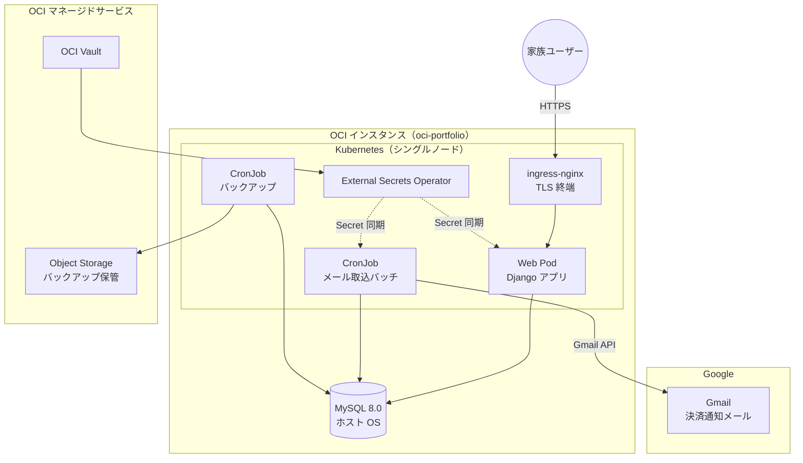
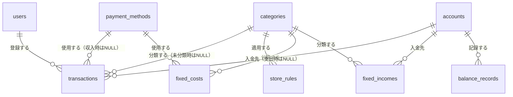
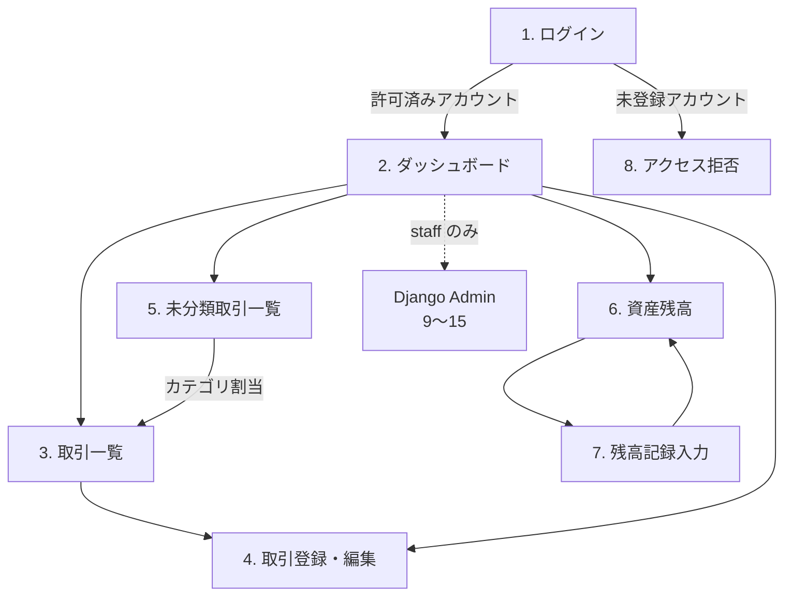

# 基本設計書 - kakeibo（OCI 移行版）

[要件定義書](../01.要件定義/要件定義書.md) に定めた要件を実現するための構造を定義する。

## 1. システム構成

### 1.1. 前提インフラ

本システムは `infra-oci-terraform` および `infra-oci-ansible` で構築済みの基盤上で稼働する。
アプリケーションのコンテナイメージおよび Kubernetes マニフェストは本リポジトリで管理する。

| 項目 | 内容 |
| ---- | ---- |
| クラウド | OCI（Always Free 枠を基本とする） |
| ホスト | Ubuntu 24.04 LTS（ホスト名 `oci-portfolio`） |
| コンテナ基盤 | kubeadm によるシングルノード Kubernetes（Control Plane 兼 Worker） |
| 外部公開 | `ingress-nginx`（HostNetwork で 80/443 を占有） |
| TLS | `cert-manager` + Let's Encrypt による証明書自動管理 |
| データベース | MySQL 8.0（ホスト OS に直接導入、`bind-address: 127.0.0.1`） |
| 機密情報 | OCI Vault + External Secrets Operator により Kubernetes Secret へ同期 |
| 永続ボリューム | `local-path-provisioner` |

本基盤は OCI のマネージド Kubernetes（OKE）ではなく、kubeadm によるセルフマネージド構成である。

### 1.2. 構成図

## 2. 技術スタック

### 2.1. バージョン確定方針

放置運用が前提のため、**Django は LTS を採用し、その対応範囲内で最も EOL が遠い Python を組み合わせる**。
これにより次回のアップグレードは Django 6.2 LTS（2027年4月リリース予定）への移行1回で済み、
Python のバージョンは据え置ける。

| ランタイム | 確定バージョン | サポート期限 | 備考 |
| ---------- | -------------- | ------------ | ---- |
| Python | **3.14** | 2030年10月 | 2025-10-07 リリース、bugfix ステータス |
| Django | **5.2 LTS** | 2028年4月 | Python 3.14 対応は **5.2.8 以降**のため、下限を 5.2.8 とする |

- Django 6.0 は非 LTS でサポートが 2027年4月頃に終了するため採用しない
- Python 3.12 はセキュリティ修正のみの段階に入っているため採用しない
- Django は 2028年から年次リリース（Django 2028、2029 …）へ移行し、全リリースが3年サポートとなる

### 2.2. 採用ライブラリ

| 分類 | 採用技術 | 選定理由 |
| ---- | -------- | -------- |
| 管理画面 | Django Admin（標準機能） | マスタ保守を追加実装なしで賄える |
| 認証 | django-allauth | Google OAuth（OpenID Connect）を標準的な手順で実装できる |
| メール取得 | google-api-python-client | Gmail API 用の Google 公式クライアント |
| DB ドライバ | mysqlclient | Django が公式に推奨する MySQL ドライバ |
| パッケージ管理 | uv | 依存解決とロックファイル管理を高速に行える |
| 環境変数管理 | django-environ | `.env` ファイルから設定を読み込み、機密情報をコードから分離する |
| アプリケーションサーバー | gunicorn | 本番環境で Django を稼働させる WSGI サーバー |
| フロントエンド | Django テンプレート + 軽量 JS | SPA を構築せず、サーバサイドレンダリングで完結させる |
| グラフ描画 | クライアントサイドのグラフライブラリ | 月次推移・構成比・資産推移の可視化に使用する |

### 2.3. 画面の使い分け方針

Django Admin は**開発者（staff 権限）のマスタ保守専用**とし、一般利用者には公開しない。
家族が使用する入力・閲覧画面は通常の Django ビューとして別途実装する。

- **理由**: Admin をそのまま家族に開放すると権限管理の粒度が粗く、誤操作でマスタを破壊するリスクがあるため

## 3. 機能設計

### 3.1. メール自動取込（要件 4.1）

#### 3.1.1. サービス識別ルール

Gmail のラベルで絞り込んだメールに対し、発信元アドレスと件名の組み合わせでサービスを識別する。

| サービス | 送信元 | 件名（部分一致） | 決済手段として記録する値 |
| -------- | ------ | ---------------- | ------------------------ |
| 楽天ペイ（アプリ決済） | `no-reply@pay.rakuten.co.jp` | 楽天ペイアプリご利用内容 | 楽天ペイ |
| 楽天ペイ（オンライン決済） | `payment@checkout.rakuten.co.jp` | 楽天ペイ（オンライン決済） | 楽天ペイ(オンライン) |
| 楽天ペイ（注文受付） | `order@checkout.rakuten.co.jp` | 楽天ペイ 注文受付 | 楽天ペイ(オンライン) |
| 楽天カード | `info@mail.rakuten-card.co.jp` | カード利用のお知らせ | 楽天カード |

#### 3.1.2. Gmail ラベル運用

| ラベル | 用途 |
| ------ | ---- |
| `家計簿/未処理` | Gmail のフィルタ機能で決済通知メールに自動付与する。バッチの処理対象 |
| `家計簿/処理済` | 取込成功時に付け替える |

解析に失敗したメールは `家計簿/未処理` のまま残し、次回実行で再処理する。

#### 3.1.3. 重複排除

| 対象 | 方式 |
| ---- | ---- |
| メール単位 | 取込済みの Gmail メッセージ ID を記録し、再取込を抑止する |
| 取引単位 | 日付・金額・店舗名・決済手段から生成したハッシュ値を保持し、同一キーの登録を抑止する |

### 3.2. カテゴリ判定（要件 4.2）

`store_rules`（店舗ルール）テーブルを参照し、以下の流れで判定する。

1. 取引の店舗名（`counterpart`）を正規化する（大文字小文字・全角半角の統一）。
2. `store_rules.keyword` に部分一致するレコードを、`priority`（定義順）の昇順で検索し、最初に一致した
   レコードの `category_id` を採用する。
3. いずれにも一致しない場合、`transactions.category_id` を `NULL`（未分類）のまま登録する。
4. 未分類一覧画面で利用者がカテゴリを割り当てると、その店舗名から抽出したキーワードを
   `store_rules` へ `is_auto_generated = TRUE` として自動登録し、以後の取込で自動判定されるようにする。
   <mark>店舗名からのキーワード抽出規則は未確定（[Issue #16](https://github.com/Seiya-Nakagawa/kakeibo/issues/16)）</mark>

### 3.3. 集計（要件 4.7）

月次集計は以下の値を対象月ごとに算出する。

| 区分 | 算出方法 |
| ---- | -------- |
| 変動費実績 | `transactions`（`transaction_type = expense`、`is_deleted = FALSE`、`is_excluded_from_aggregation = FALSE`）を対象月・カテゴリで集計 |
| 固定費実績 | `fixed_costs` のうち、対象月が `start_month` 〜 `end_month`（`NULL` は継続中）に含まれる定義を、取引レコードを生成せずカテゴリ別に加算 |
| カテゴリ別支出実績 | 変動費実績 + 固定費実績 |
| 予算差額 | `categories.monthly_budget` − カテゴリ別支出実績（`is_aggregated = FALSE` のカテゴリは集計・予算対比の対象外とする） |
| 収入実績 | `transactions`（`transaction_type = income`）の対象月合計 + `fixed_incomes` のうち対象月が適用期間内の定義の合計 |
| 収支差額 | 収入合計 − 支出合計（変動費 + 固定費） |
| 総資産 | 口座（`accounts`）ごとの `balance_records` の最新記録（対象月末以前で最も新しい `recorded_date`）を合算 |

振替・返金など集計対象外としたい取引は、`transactions.is_excluded_from_aggregation` を `TRUE` にすることで
上記いずれの集計からも除外する。

発生主義（利用日基準）による支出・収支の実績（本節）と、手動記録による資産残高の実額
（5.3.5 節）は、決済手段と口座の自動紐づけ・差分計算を行わず、それぞれ独立した情報として提示する。
クレジットカード利用が引落口座へ反映されるまでのタイムラグによる差異は、利用者が両画面を
見比べて把握するものとし、システム側での自動的な埋め合わせは行わない。

## 4. データベース設計

### 4.1. 共通方針

| 項目 | 内容 |
| ---- | ---- |
| DBMS | MySQL 8.0（既存インスタンスを共用） |
| スキーマ | 本システム専用スキーマを作成する |
| 接続ユーザー | 個人開発プロジェクト間で共通の MySQL ユーザーを使用する。GRANT は本システムのスキーマへの権限のみをそのユーザーに個別付与し、他プロジェクトのスキーマへの権限は含めない（ユーザーは共有するが、スキーマ単位で権限を分離する） |
| 文字コード | `utf8mb4` |
| 照合順序 | `utf8mb4_0900_ai_ci` |
| 金額の型 | 整数（円）。浮動小数点数を用いない |
| 日時の扱い | アプリケーション側で `Asia/Tokyo` を基準に扱う |
| 削除方式 | 取引データは論理削除とし、物理削除しない |
| スキーマ変更 | Django のマイグレーションで管理し、手動 DDL を行わない |
| Pod からの接続方式 | DB へ接続する Pod（Web、CronJob）は、ホストの `/var/run/mysqld` を `hostPath` でマウントし、Unix ドメインソケット経由で MySQL へ接続する |

#### 4.1.1. Pod から MySQL への接続方式

ホスト OS の MySQL は `bind-address: 127.0.0.1` で待ち受けており、これは
`infra-oci-ansible` 側で「外部からの直接接続は原則禁止」として意図的に設定されたものである。
シングルノード kubeadm クラスタでは Pod は独立したネットワーク namespace を持つため、
既定のままではホストの `127.0.0.1` へ到達できない。
一方、MySQL は `bind-address` の設定に関係なく、常に Unix ドメインソケット
（`/var/run/mysqld/mysqld.sock`）でも待ち受けている。

| 選択肢 | 採用 | 理由 |
| ------ | ---- | ---- |
| Unix ドメインソケットを共有する（ホストの `/var/run/mysqld` を `hostPath` で Pod にマウント） | **採用** | ネットワーク経由の接続を伴わないため、Pod がホストの全ネットワークインタフェースへ到達可能になることも、DB を TCP で公開することもない。MySQL 側の設定変更（`bind-address` 変更）も不要 |
| Web Pod・CronJob Pod を `hostNetwork: true` で稼働させる | 不採用 | Pod がホストのネットワーク namespace を丸ごと共有する。外部公開される Web アプリ（攻撃対象になりうる）が侵害された場合、ホストの全ネットワークインタフェース・全ポートへ到達可能になる。狭い役割のプロキシである `ingress-nginx` と異なり、汎用的な自作アプリに同じ手法を使うのはリスクが大きい。ホストのポート空間を直接占有するため、`infra-oci-ansible` 側で将来追加されるホストサービスとのポート衝突リスクもある |
| Headless Service + Endpoints でホストの実 IP を参照する | 不採用 | MySQL が `127.0.0.1` のみで待ち受けているため、結局 `bind-address` の変更（実 IP または `0.0.0.0` での待受）を伴い、次の選択肢と同じ問題を抱える |
| `bind-address` を変更し、ホストの実 IP または `0.0.0.0` で待ち受ける | 不採用 | DB がホストのネットワークインタフェースに公開され、`infra-oci-ansible` 側の設計方針（原則禁止）と相反する。OCI セキュリティ・リストや `ufw` 等の追加の防御層が必要になる |

- 対象は DB へ接続する Web Pod と CronJob Pod（メール取込・バックアップ）のみとし、
  それ以外の Pod は通常の Pod ネットワークのままとする
- マウント対象はソケットファイル単体ではなく `/var/run/mysqld` ディレクトリとし、
  `mysqld` 再起動によるソケットファイルの再生成に追随できるようにする
- Pod 起動時に initContainer（root 権限、最小構成イメージ）が当該ソケットファイルの
  パーミッションを調整し、アプリケーションコンテナ（非 root ユーザー）から読み書きできる
  状態にしてから本体コンテナを起動する
- 接続には Django（`mysqlclient`）の Unix ソケット接続機能を使用し、TCP 接続は行わない。
  認証は個人開発プロジェクト間で共通の MySQL ユーザーによるパスワード認証をそのまま使用する
  （`auth_socket` プラグインは MySQL 設計書上 `root` 専用であり、認証方式は変わらない）
- DB への接続元は、引き続き MySQL のユーザー権限（本システムのスキーマへの GRANT のみ）でも制限する

### 4.2. テーブル定義

管理対象の情報単位は[要件定義書 第5章](../01.要件定義/要件定義書.md)を参照。
物理テーブル名は Django の既定命名規則（`{アプリ名}_{モデル名}`）に従うため、以下は論理名で記載する。

#### 4.2.1. ER 図

#### 4.2.2. users（利用者）

| カラム | 型 | 制約 | 内容 |
| ------ | -- | ---- | ---- |
| id | BIGINT | PK, AUTO_INCREMENT | |
| google_sub | VARCHAR(255) | NOT NULL, UNIQUE | Google OAuth の `sub`（ユーザー識別子） |
| email | VARCHAR(255) | NOT NULL, UNIQUE | |
| display_name | VARCHAR(100) | NOT NULL | |
| role | VARCHAR(20) | NOT NULL | `admin` / `general` |
| is_active | BOOLEAN | NOT NULL, DEFAULT TRUE | ログイン許可の有効フラグ |
| created_at / updated_at | DATETIME | NOT NULL | |

#### 4.2.3. categories（カテゴリ）

| カラム | 型 | 制約 | 内容 |
| ------ | -- | ---- | ---- |
| id | BIGINT | PK, AUTO_INCREMENT | |
| name | VARCHAR(50) | NOT NULL | |
| category_type | VARCHAR(20) | NOT NULL | `expense` / `income` |
| monthly_budget | INT | NULL | 月次予算（円）。主に `expense` で使用 |
| is_aggregated | BOOLEAN | NOT NULL, DEFAULT TRUE | 集計・予算対比の対象とするか |
| display_order | INT | NOT NULL, DEFAULT 0 | |
| created_at / updated_at | DATETIME | NOT NULL | |

制約: `UNIQUE (name, category_type)`

#### 4.2.4. store_rules（店舗ルール）

| カラム | 型 | 制約 | 内容 |
| ------ | -- | ---- | ---- |
| id | BIGINT | PK, AUTO_INCREMENT | |
| keyword | VARCHAR(100) | NOT NULL, UNIQUE | 正規化済みの店舗名キーワード |
| category_id | BIGINT | NOT NULL, FK → categories.id | |
| priority | INT | NOT NULL | 定義順（小さいほど優先） |
| is_auto_generated | BOOLEAN | NOT NULL, DEFAULT FALSE | 未分類割当時の自動学習で登録されたか |
| created_at / updated_at | DATETIME | NOT NULL | |

#### 4.2.5. payment_methods（決済手段）

| カラム | 型 | 制約 | 内容 |
| ------ | -- | ---- | ---- |
| id | BIGINT | PK, AUTO_INCREMENT | |
| name | VARCHAR(50) | NOT NULL, UNIQUE | |
| display_order | INT | NOT NULL, DEFAULT 0 | |
| is_active | BOOLEAN | NOT NULL, DEFAULT TRUE | |

#### 4.2.6. accounts（口座）

| カラム | 型 | 制約 | 内容 |
| ------ | -- | ---- | ---- |
| id | BIGINT | PK, AUTO_INCREMENT | |
| name | VARCHAR(50) | NOT NULL | |
| account_type | VARCHAR(20) | NOT NULL | `bank` / `securities` / `emoney` / `cash` / `other` |
| currency | VARCHAR(3) | NOT NULL, DEFAULT 'JPY' | |
| display_order | INT | NOT NULL, DEFAULT 0 | |
| is_active | BOOLEAN | NOT NULL, DEFAULT TRUE | |
| created_at / updated_at | DATETIME | NOT NULL | |

#### 4.2.7. balance_records（残高記録）

| カラム | 型 | 制約 | 内容 |
| ------ | -- | ---- | ---- |
| id | BIGINT | PK, AUTO_INCREMENT | |
| account_id | BIGINT | NOT NULL, FK → accounts.id | |
| recorded_date | DATE | NOT NULL | 基準日 |
| balance | INT | NOT NULL | 円 |
| created_at / updated_at | DATETIME | NOT NULL | |

制約: `UNIQUE (account_id, recorded_date)`（要件 4.6.3、再登録時は上書き）

#### 4.2.8. fixed_costs（固定費）

| カラム | 型 | 制約 | 内容 |
| ------ | -- | ---- | ---- |
| id | BIGINT | PK, AUTO_INCREMENT | |
| payee | VARCHAR(100) | NOT NULL | 支払先 |
| amount | INT | NOT NULL | 円 |
| category_id | BIGINT | NOT NULL, FK → categories.id | |
| payment_method_id | BIGINT | NOT NULL, FK → payment_methods.id | |
| start_month | DATE | NOT NULL | 適用開始月（当月1日で保持） |
| end_month | DATE | NULL | 適用終了月。`NULL` は継続中 |
| memo | VARCHAR(255) | NULL | |
| created_at / updated_at | DATETIME | NOT NULL | |

同一 `payee` で期間の異なる複数レコードを許容する（要件 4.4.4、金額改定対応）。

#### 4.2.9. fixed_incomes（固定収入）

| カラム | 型 | 制約 | 内容 |
| ------ | -- | ---- | ---- |
| id | BIGINT | PK, AUTO_INCREMENT | |
| source | VARCHAR(100) | NOT NULL | 勤務先名等 |
| amount | INT | NOT NULL | 円 |
| category_id | BIGINT | NOT NULL, FK → categories.id | |
| account_id | BIGINT | NOT NULL, FK → accounts.id | 入金先口座 |
| start_month | DATE | NOT NULL | |
| end_month | DATE | NULL | |
| memo | VARCHAR(255) | NULL | |
| created_at / updated_at | DATETIME | NOT NULL | |

#### 4.2.10. transactions（取引）

| カラム | 型 | 制約 | 内容 |
| ------ | -- | ---- | ---- |
| id | BIGINT | PK, AUTO_INCREMENT | |
| transaction_type | VARCHAR(20) | NOT NULL | `expense` / `income` |
| transaction_date | DATE | NOT NULL | 利用日（発生主義の計上基準） |
| amount | INT | NOT NULL | 円 |
| counterpart | VARCHAR(100) | NOT NULL | 店舗名（支出）／収入元（収入） |
| category_id | BIGINT | NULL, FK → categories.id | `NULL` は未分類（支出のみ発生） |
| payment_method_id | BIGINT | NULL, FK → payment_methods.id | 支出時に設定。収入時は `NULL` |
| account_id | BIGINT | NULL, FK → accounts.id | 収入時の入金先。支出時は `NULL` |
| memo | VARCHAR(255) | NULL | |
| source | VARCHAR(20) | NOT NULL | `mail` / `manual` |
| dedup_hash | CHAR(64) | NULL, UNIQUE | 日付・金額・店舗名・決済手段から生成。メール取込時のみ設定 |
| is_excluded_from_aggregation | BOOLEAN | NOT NULL, DEFAULT FALSE | 振替・返金など集計対象外の取引 |
| is_deleted | BOOLEAN | NOT NULL, DEFAULT FALSE | 論理削除 |
| created_by | BIGINT | NOT NULL, FK → users.id | 登録者（要件 4.9.5） |
| created_at / updated_at | DATETIME | NOT NULL | |

インデックス: `transaction_date`、`category_id`、`transaction_type` に付与し、一覧の絞り込みと月次集計を高速化する。
MySQL の `UNIQUE` 制約は `NULL` 同士を重複と見なさないため、`dedup_hash` が `NULL`（手動入力）の行は制約対象外となる。

#### 4.2.11. email_import_logs（取込ログ）

| カラム | 型 | 制約 | 内容 |
| ------ | -- | ---- | ---- |
| id | BIGINT | PK, AUTO_INCREMENT | |
| gmail_message_id | VARCHAR(100) | NOT NULL, UNIQUE | 再取込抑止に使用（要件 4.1.3.1） |
| service | VARCHAR(50) | NULL | 識別できたサービス名。識別失敗時は `NULL` |
| status | VARCHAR(20) | NOT NULL | `success` / `failed` |
| error_detail | VARCHAR(500) | NULL | |
| executed_at | DATETIME | NOT NULL | |

## 5. 画面設計

[2.3 節](#23-画面の使い分け方針)の方針により、マスタ保守は Django Admin（staff 専用）、
それ以外は家族向けの通常 Django ビューとして分離する。

### 5.1. 画面一覧

#### 5.1.1. 家族向け画面（Django ビュー、要ログイン）

| # | 画面名 | 概要 | 対応要件 |
| - | ------ | ---- | -------- |
| 1 | ログイン | Google アカウントによるログイン開始 | 4.9 |
| 2 | ダッシュボード | 月次収支・カテゴリ別支出・予算対比・各種グラフを表示するトップ画面 | 4.7 |
| 3 | 取引一覧 | 期間・カテゴリ・決済手段・金額範囲・店舗名で絞り込み、CSV 出力 | 4.7.5, 4.7.6 |
| 4 | 取引登録・編集 | 支出・収入の手動入力、既存取引の修正・削除 | 4.3, 4.5 |
| 5 | 未分類取引一覧 | 未分類（`category_id IS NULL`）の取引にカテゴリを割り当てる | 4.2.5, 4.2.6 |
| 6 | 資産残高 | 口座別残高・総資産と資産推移グラフを表示 | 4.6.4, 4.6.5 |
| 7 | 残高記録入力 | 口座・基準日を指定して残高を記録 | 4.6.2, 4.6.3 |
| 8 | アクセス拒否 | 未登録の Google アカウントでログインした際に表示 | 4.9.2 |

#### 5.1.2. 管理者向け画面（Django Admin、staff 専用）

| # | 画面名 | 概要 | 対応要件 |
| - | ------ | ---- | -------- |
| 9 | カテゴリ管理 | 支出/収入区分・月次予算・集計対象フラグの保守 | 4.8 |
| 10 | 店舗ルール管理 | キーワードとカテゴリの対応の保守（自動学習分の編集・削除を含む） | 4.2.7, 4.8 |
| 11 | 固定費管理 | 固定費定義の保守 | 4.4, 4.8 |
| 12 | 固定収入管理 | 固定収入定義の保守 | 4.5.4, 4.8 |
| 13 | 口座管理 | 口座マスタの保守 | 4.6.1, 4.8 |
| 14 | 決済手段管理 | 決済手段マスタの保守 | 4.8 |
| 15 | 利用者管理 | ログイン許可アカウントと権限の保守 | 4.8, 4.9 |

管理者向け画面は Django Admin の標準機能で賄うため、個別の画面遷移・項目設計は行わない。

### 5.2. 画面遷移図

### 5.3. 主要画面の項目

#### 5.3.1. ダッシュボード（2）

| 項目 | 内容 |
| ---- | ---- |
| 月選択 | 対象月を切り替える |
| サマリー | 収入合計・支出合計・収支差額 |
| カテゴリ別支出 | カテゴリごとの実績・予算・差額（予算超過は強調表示） |
| グラフ | 月次支出推移（直近12ヶ月）、当月カテゴリ別構成比、月次収支推移、総資産推移 |
| 未分類件数 | 未分類取引がある場合に件数を表示し、5. 未分類取引一覧へ導線を出す |

#### 5.3.2. 取引一覧（3）

| 項目 | 内容 |
| ---- | ---- |
| 絞り込み条件 | 期間、カテゴリ、決済手段、金額範囲、店舗名 |
| 一覧項目 | 日付、種別（支出/収入）、店舗名・収入元、カテゴリ、金額、決済手段/入金先口座、登録者 |
| 操作 | 行から編集・削除、CSV 出力 |

#### 5.3.3. 取引登録・編集（4）

| 項目 | 内容 |
| ---- | ---- |
| 種別 | 支出 / 収入（切替でフォーム項目が変わる） |
| 共通項目 | 日付（必須）、金額（必須）、店舗名・収入元（必須）、カテゴリ、メモ |
| 支出項目 | 決済手段 |
| 収入項目 | 入金先口座 |
| 除外フラグ | 振替・返金など集計対象外とする指定（`is_excluded_from_aggregation`） |

#### 5.3.4. 未分類取引一覧（5）

| 項目 | 内容 |
| ---- | ---- |
| 一覧項目 | 日付、店舗名、金額、決済手段 |
| 操作 | カテゴリ選択・割当（割当時に店舗ルールへ自動学習登録） |

#### 5.3.5. 資産残高（6）

| 項目 | 内容 |
| ---- | ---- |
| サマリー | 最新記録日時点の総資産、口座種別ごとの内訳 |
| グラフ | 月次の総資産推移 |
| 口座一覧 | 口座ごとの最新残高・記録日 |

## 6. 外部インタフェース設計

### 6.1. Gmail API

| 項目 | 内容 |
| ---- | ---- |
| 用途 | 決済通知メールの取得、ラベルの付け替え、エラー通知メールの送信 |
| クライアント | google-api-python-client |
| 認証方式 | OAuth 2.0（OAuth 同意画面を本番公開） |
| 使用スコープ | `gmail.readonly`、`gmail.labels`、`gmail.send`（必要最小限に限定） |
| 認証情報の保管 | OCI Vault → External Secrets Operator → Kubernetes Secret |

#### 6.1.1. 認証情報の維持方式

| 選択肢 | 採用 | 理由 |
| ------ | ---- | ---- |
| OAuth 同意画面を本番公開する | **採用** | 「テスト」状態特有のリフレッシュトークン7日失効を回避できる。日次でAPIを呼び出すため、長期未使用による失効も発生しない |
| サービスアカウント + ドメイン全体の委任 | 不採用 | ドメイン全体の委任は Google Workspace の管理者コンソールが必要であり、家族が保有する個人の Google アカウント（[要件定義書 7.1節](../01.要件定義/要件定義書.md)）では利用できない |

### 6.2. バッチの起動方式

| バッチ | 起動方式 | 実行頻度 |
| ------ | -------- | -------- |
| メール取込 | Kubernetes CronJob | 日次 |
| バックアップ | Kubernetes CronJob | 日次 |

いずれも Django の管理コマンドとして実装し、CronJob から呼び出す。

### 6.3. データ移行（要件 4.10）

現行スプレッドシートから CSV でエクスポートしたファイルを入力とし、
Django の管理コマンドで一括投入する。繰り返し実行できるものとする。

## 7. 非機能要件の実現方式

### 7.1. 可用性・復旧（要件 6.1）

インスタンス障害時は、Terraform によるリソース再作成と Ansible による構成適用で基盤を復元し、
本リポジトリのマニフェスト適用とバックアップからのリストアでアプリケーションを復旧する。

### 7.2. バックアップ（要件 6.4）

| 項目 | 内容 |
| ---- | ---- |
| 実行方式 | Kubernetes CronJob により日次実行 |
| 取得方法 | `mysqldump` による論理バックアップ、gzip 圧縮 |
| 保管先 | OCI Object Storage |
| 世代管理 | 日次 30 世代、月次 12 世代 |

想定されるリソース消費は OCI Always Free 枠に収まる。

| 項目 | Always Free 枠 | 想定使用量 |
| ---- | -------------- | ---------- |
| Object Storage 容量 | 20 GB（Standard / IA / Archive の合計） | 数十 MB |
| Object Storage API リクエスト | 50,000 リクエスト / 月 | 100 リクエスト未満 / 月 |
| 送信データ転送 | 10 TB / 月 | 実質なし（アップロードは対象外） |

### 7.3. セキュリティ（要件 6.3）

認証情報（Google OAuth クライアントシークレット、リフレッシュトークン、DB パスワード等）は
OCI Vault で管理し、External Secrets Operator 経由で Kubernetes Secret として供給する。
ソースコードおよびコンテナイメージには埋め込まない。

| 項目 | 内容 |
| ---- | ---- |
| `DEBUG` | 本番環境では必ず無効にする |
| `ALLOWED_HOSTS` | 公開ドメインのみを明示的に指定する |
| セキュリティ機構 | Django 標準の CSRF 対策・XSS 対策・セキュアクッキーを有効にする |
| TLS | ingress-nginx で終端し、cert-manager が証明書を自動更新する |
| DB 公開範囲 | Web Pod・CronJob Pod は Unix ドメインソケット（`hostPath` でマウントした `/var/run/mysqld`）経由で MySQL へ接続し、ネットワーク経由の接続は一切行わない（詳細は 4.1.1 節） |

### 7.4. 運用・保守（要件 6.5）

| 項目 | 内容 |
| ---- | ---- |
| ログ出力 | 標準出力へ出力し、Kubernetes のログ基盤で参照する |
| デプロイ | コンテナイメージのビルドと Kubernetes マニフェストの適用により行う |
| スキーマ変更 | Django のマイグレーションで管理する |
| 通知 | Gmail API（`gmail.send` スコープ、6.1節）で、家族の代表メールアドレス宛にメール送信する。追加の外部サービス・SMTP認証情報は新設しない |
