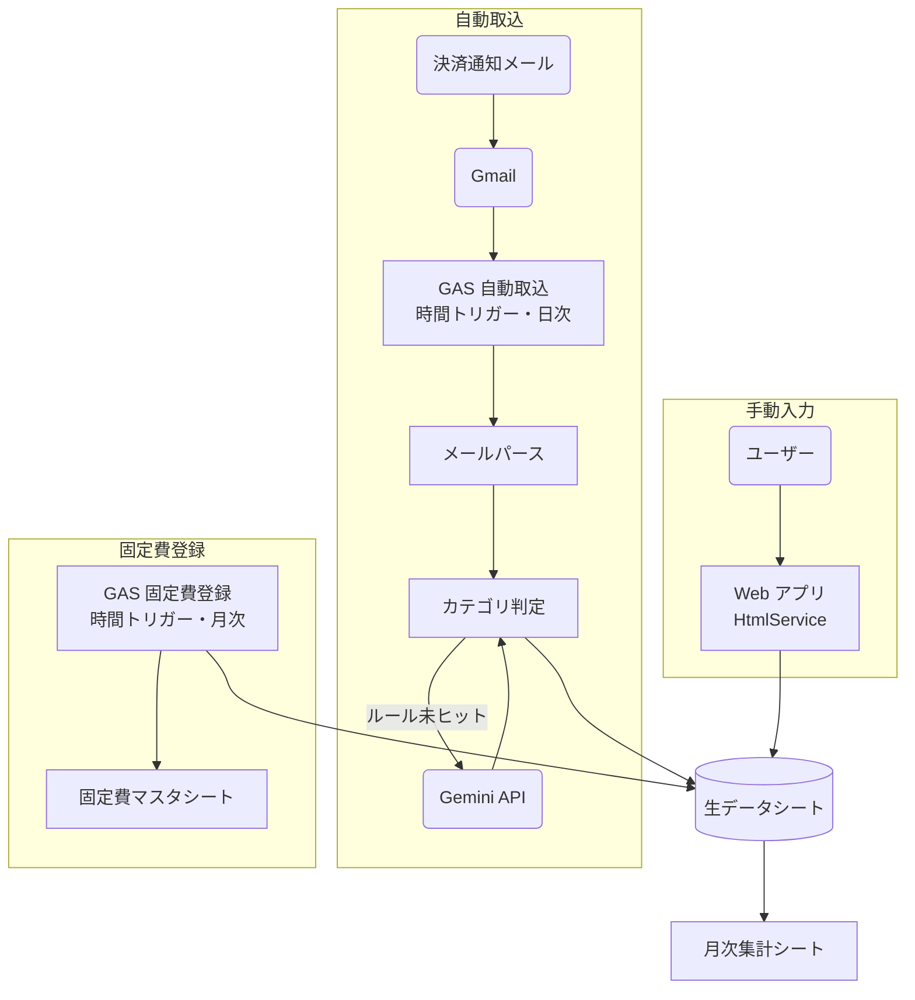
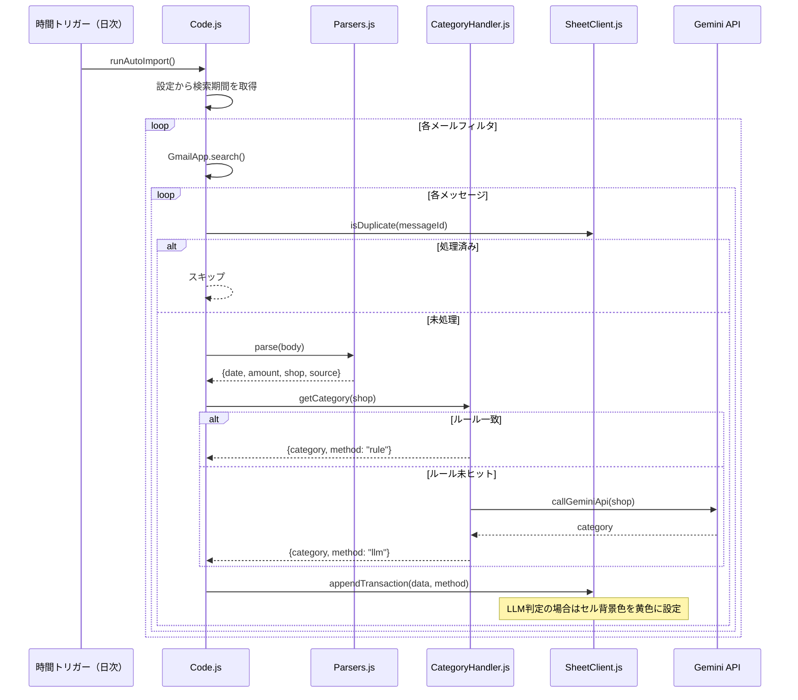

# 基本設計書（現行 GAS 版）

> **注記**: 本ドキュメントは現在稼働中の GAS + Google スプレッドシート版システムの記録である。
> OCI 移行後の新システムの要件は [`01.要件定義/要件定義書.md`](01.要件定義/要件定義書.md) を参照すること。
> 移行完了後に本ドキュメントは廃止する。

## 1. システム構成

### 1.1. システム構成図



### 1.2. 利用技術・サービス

| 分類 | 技術・サービス | 目的 |
| ---- | -------------- | ---- |
| プラットフォーム | Google Apps Script | 実行環境（無料） |
| ストレージ | Google スプレッドシート | 家計簿本体 |
| メール | GmailApp | 決済通知メール取得 |
| AI | Gemini API（無料枠） | カテゴリ自動判定 |
| Web | GAS HtmlService | 手動入力 Web 画面 |
| HTTP通信 | UrlFetchApp | Gemini API リクエスト |

## 2. スプレッドシート設計

### 2.1. 生データシート

ファイル名: `kakeibo`、シート名: `生データ`

| 列 | ヘッダー | 型 | 説明 |
| -- | -------- | -- | ---- |
| A | 日付 | Date（`YYYY-MM-DD`） | 利用日 |
| B | 金額 | Integer | 支出額（円） |
| C | 店舗名 | String | 利用店舗・支払先 |
| D | 決済手段 | String | 楽天ペイ / 楽天カード / 固定 / 手動 など |
| E | カテゴリ | String | オリジナルカテゴリ名 |
| F | メモ | String | 任意メモ |
| G | 登録方法 | String | `auto` / `fixed` / `manual` |
| H | 重複排除キー | String | SHA-256 ハッシュ（非表示列） |

**セルの書式ルール**:

- E列（カテゴリ）のセルは、Gemini API で判定した場合に背景色を黄色（`#FFF2CC`）で塗る
- ユーザーが手動修正した場合は背景色をクリア（未実装フェーズではユーザー手動でクリア）

### 2.2. 月次集計シートのマスターデータ（A〜C列）

カテゴリマスタは独立したシートではなく、月次集計シートの A〜C 列で管理する。

| 列 | ヘッダー | 説明 |
| -- | -------- | ---- |
| A | カテゴリ名 | 一意のカテゴリ名（例: 食費、日用雑貨、交通） |
| B | 月次予算 | カテゴリごとの月次予算（円）。0 は未設定 |
| C | 集計対象 | TRUE: 月次集計に含める / FALSE: 集計対象外（チェックボックス） |

**初期カテゴリ**:

| カテゴリ名 | 集計対象 |
| ---------- | -------- |
| 食費 | TRUE |
| 日用雑貨 | TRUE |
| 交通 | TRUE |
| 通信 | TRUE |
| 医療・保険 | TRUE |
| エンタメ | TRUE |
| 旅行 | TRUE |
| 住宅 | TRUE |
| サブスクリプション | TRUE |
| その他 | TRUE |
| 対象外 | FALSE |

`対象外` は振替・返金など集計に含めたくない取引に使用する。Gemini API および Web アプリの選択肢にも表示される。

### 2.3. 店舗ルールシート

シート名: `店舗ルール`

| 列 | ヘッダー | 説明 |
| -- | -------- | ---- |
| A | 店舗名キーワード | 部分一致で判定するキーワード |
| B | カテゴリ名 | 月次集計シートA列の値を参照 |

- 上から順に評価し、最初にヒットしたカテゴリを採用する
- 大文字小文字・全半角を正規化してから比較する

### 2.4. 固定費マスタシート

シート名: `固定費マスタ`

| 列 | ヘッダー | 説明 |
| -- | -------- | ---- |
| A | 店舗名 / 支払先 | 例: 住宅ローン |
| B | 金額 | 固定金額（円） |
| C | カテゴリ名 | 月次集計シートA列の値を参照 |
| D | 決済手段 | 例: 口座引落 |
| E | 開始月 | 適用開始月（YYYY/MM 形式の日付。空欄 = 常時適用） |
| F | メモ | 任意 |

固定費は生データシートにコピーせず、月次集計シートの SUMIFS から直接参照する。
`開始月 <= 集計月` の行のみが各月の集計に含まれる。途中追加した費用は開始月以前の月には計上されない。

### 2.5. 月次集計シート

シート名: `月次集計`

`refreshMonthlySummary()` によって自動生成される。`runAutoImport()` 実行後に自動更新される。

**A〜C列はカテゴリマスタとして機能する**（ユーザーが直接編集する）。D列以降は数式で自動生成。

| 列 | 内容 |
| -- | ---- |
| A | カテゴリ名（ユーザー管理） |
| B | 月次予算（ユーザー管理） |
| C | 集計対象（TRUE/FALSE チェックボックス、ユーザー管理） |
| D | 当月実績（変動費 + 固定費、数式自動生成） |
| E | 差額（予算 − 実績、マイナス赤字表示、数式自動生成） |
| F〜J | 前月〜5ヶ月前の実績（変動費 + 固定費、数式自動生成） |

- 実績 = `SUMIFS(生データ)` + `SUMIFS(固定費マスタ)` の合算
- 集計対象=FALSE のカテゴリ（例: 対象外）は実績欄が空になり合計にも含まれない
- 最終行に合計行を表示する（予算合計・実績合計・差額合計）
- 差額がマイナス（予算超過）の場合は赤字で表示する

## 3. GAS モジュール構成

| ファイル名 | 役割 | 主要な関数 |
| ---------- | ---- | ---------- |
| `Code.js` | エントリーポイント | `runAutoImport()` |
| `Config.js` | 設定・定数 | `MAIL_FILTERS`, `COL`, `CAT_COL` など |
| `Parsers.js` | メールパース | `rakutenPay()`, `rakutenPayOnline()`, `rakutenCard()` |
| `CategoryHandler.js` | カテゴリ判定 | `getCategory()`, `callGeminiApi()`, `extractShopKeyword()` |
| `SheetClient.js` | スプレッドシート操作 | `appendTransaction()`, `getCategories()`, `refreshMonthlySummary()`, `compactRawSheet()` |
| `WebApp.js` | Web アプリ | `doGet()`, `apiAddEntry()` |
| `appsscript.json` | マニフェスト | スコープ設定 |

## 4. 機能設計

### 4.1. 自動取込フロー



### 4.2. カテゴリ判定

```javascript
// 判定優先順位
function getCategory(shopName) {
  // 1. 店舗ルールシートを上から順に部分一致で検索
  const rulesSheet = getSheetByName('店舗ルール');
  const rules = rulesSheet.getDataRange().getValues();
  const normalized = normalize(shopName); // 全角→半角、大文字→小文字
  for (const [keyword, category] of rules) {
    if (normalized.includes(normalize(keyword))) {
      return { category, method: 'rule' };
    }
  }

  // 2. Gemini API にフォールバック
  const category = callGeminiApi(shopName);
  return { category, method: 'llm' };
}
```

**Gemini API プロンプト設計**:

```
以下の店舗名を、家計簿のカテゴリに分類してください。
カテゴリは必ず次のリストから1つだけ選んでください: {カテゴリ一覧}

店舗名: {shopName}

カテゴリ名のみ返答してください。
```

### 4.3. 重複排除

- メッセージIDをスクリプトプロパティに記録し、処理済みかを判定する
- 生データシートの H 列（重複排除キー）は、手動入力 / 固定費の二重登録防止に使用する
  - キー = `SHA256(日付 + 金額 + 店舗名 + 決済手段)`
  - GAS 標準の `Utilities.computeDigest` で生成する

### 4.4. Web アプリ画面設計

**URL**: GAS Web アプリとして公開（アクセス権: 自分のみ）

**画面構成**:

```
┌────────────────────────────────────────┐
│  家計簿 - 手動入力                      │
├────────────────────────────────────────┤
│ 日付      [2026-04-15      ]            │
│ 金額      [        ] 円                 │
│ 店舗名    [                ]            │
│ カテゴリ  [-- 選択 --      ▼]           │
│ 決済手段  [現金            ▼]           │
│ メモ      [                ]            │
│                       [登録する]        │
├────────────────────────────────────────┤
│ 直近の登録（10件）                      │
│ 日付       金額  店舗名   カテゴリ  削除 │
│ 2026-04-15  500  〇〇スーパー  食費 [×] │
│ ...                                     │
└────────────────────────────────────────┘
```

**API エンドポイント**:

| 処理 | メソッド | 内容 |
| ---- | -------- | ---- |
| 画面表示 | `doGet()` | HTML を返す。カテゴリ一覧をスプレッドシートから取得して埋め込む |
| 登録 | `doPost()` | フォームデータを受け取り `appendTransaction()` を呼ぶ |
| 直近一覧取得 | `doGet(?action=list)` | 生データシートの末尾10件を JSON で返す |
| 削除 | `doPost(?action=delete)` | 行番号を受け取り該当行を削除 |

## 5. トリガー設計

| トリガー名 | 関数 | 種別 | タイミング |
| ---------- | ---- | ---- | ---------- |
| 自動取込 | `runAutoImport()` | 時間主導型 | 毎日 AM 7:00 |

トリガーは GAS エディタの「トリガー」メニューから手動で設定する。
固定費は月次トリガー不要。固定費マスタを直接参照するため常に最新状態が反映される。

## 6. メールフィルタ設定

`Config.js` で定義する。

| サービス | 検索クエリ（GmailApp.search 形式） | パーサー |
| -------- | ---------------------------------- | -------- |
| 楽天ペイ（アプリ） | `from:rakutengroup@mail.rakuten.com subject:楽天ペイアプリご利用内容` | `Parsers.rakutenPay()` |
| 楽天ペイ（オンライン） | `from:payment@checkout.rakuten.co.jp subject:楽天ペイ（オンライン決済）` | `Parsers.rakutenPayOnline()` |
| 楽天ペイ（注文受付） | `from:order@checkout.rakuten.co.jp subject:楽天ペイ 注文受付` | `Parsers.rakutenPayOnline()` |
| 楽天カード | `from:info@mail.rakuten-card.co.jp subject:楽天カード利用のお知らせ` | `Parsers.rakutenCard()` |

## 7. セキュリティ設計

認証情報は全てスクリプトプロパティで管理する。

| プロパティ名 | 内容 |
| ------------ | ---- |
| `GEMINI_API_KEY` | Gemini API キー |
| `SPREADSHEET_ID` | スプレッドシート ID |
| `SEARCH_TARGET_DAYS_AGO` | 検索対象日数（例: `3`） |
| `PROCESSED_MESSAGE_IDS` | 処理済みメッセージ ID（JSON 配列文字列） |

## 8. セットアップ手順

1. スプレッドシートに以下のシートを手動で作成する: `生データ`、`店舗ルール`、`固定費マスタ`、`月次集計`
2. 各シートのヘッダー行を設定する（カラム構成は本ドキュメントの各シート定義を参照）
3. 月次集計シートの A〜C 列にカテゴリマスタを入力する
4. GAS エディタの「トリガー」メニューで `runAutoImport` を時間主導型・毎日 AM 7:00 に設定する
5. スクリプトプロパティに `GEMINI_API_KEY` を設定する
